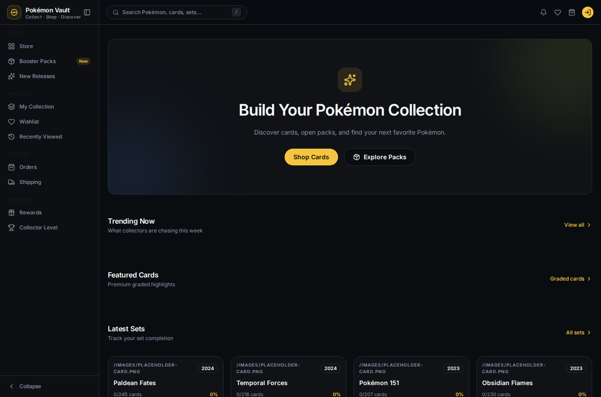

# 01 — Getting Started

This guide shows how to get the Pokémon Vault dev environment running and
where everything lives, so you can follow the rest of the journey guides with
the same setup the screenshots were captured from.

## Requirements

- Node.js **>= 22.12** (the repo pins `packageManager: pnpm@10.12.1`)
- pnpm **>= 9**
- PostgreSQL and Redis (either local, or via `docker compose`)

## One-command dev stack

The quickest path is the native dev script (no Docker needed):

```bash
./scripts/dev-env.sh up      # provision DB + build + start api/worker/web
```

The script provisions a **disposable** `pokemon_vault_dev` database
(drop → migrate → seed), builds the API, worker and web, starts them, and waits
until every service is ready. It prints:

```text
[dev-env] stack is up: api :3001 · web :3000 · worker · db pokemon_vault_dev
```

> Prefer Docker? `docker compose up -d` gives the same topology.

## What runs where

| Service | URL | What it is |
|---|---|---|
| **Web** | http://localhost:3000 | the storefront you browse |
| **API** | http://localhost:3001 | the backend (JSON under `/api/v1`) |
| API docs | http://localhost:3001/api/v1/docs | OpenAPI/Swagger UI |
| Worker | — | background job consumer (BullMQ + Redis) |
| Docs site | http://localhost:8080 | rendered project docs |



## Checking the stack

```bash
./scripts/dev-env.sh status   # shows PIDs + readiness
```

Or open <http://localhost:3000> — the storefront loads catalog data straight
from the backend.

## Next

→ [02 — Browse as a guest](02-browse-as-guest.md)
