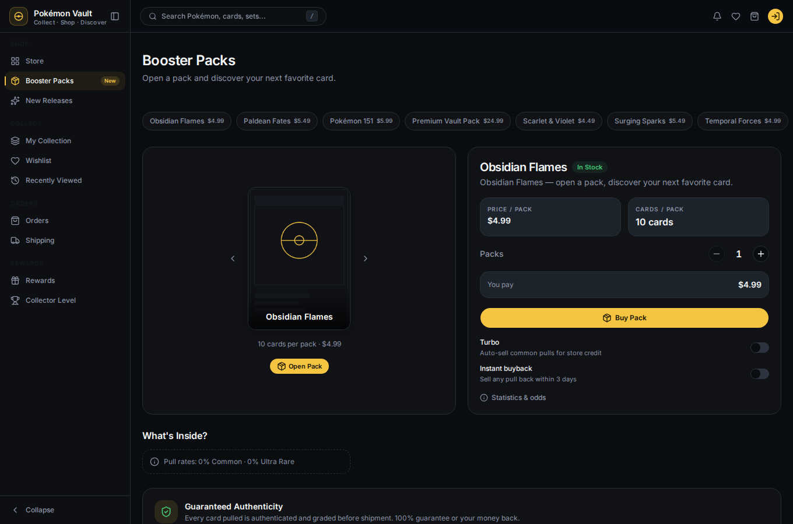
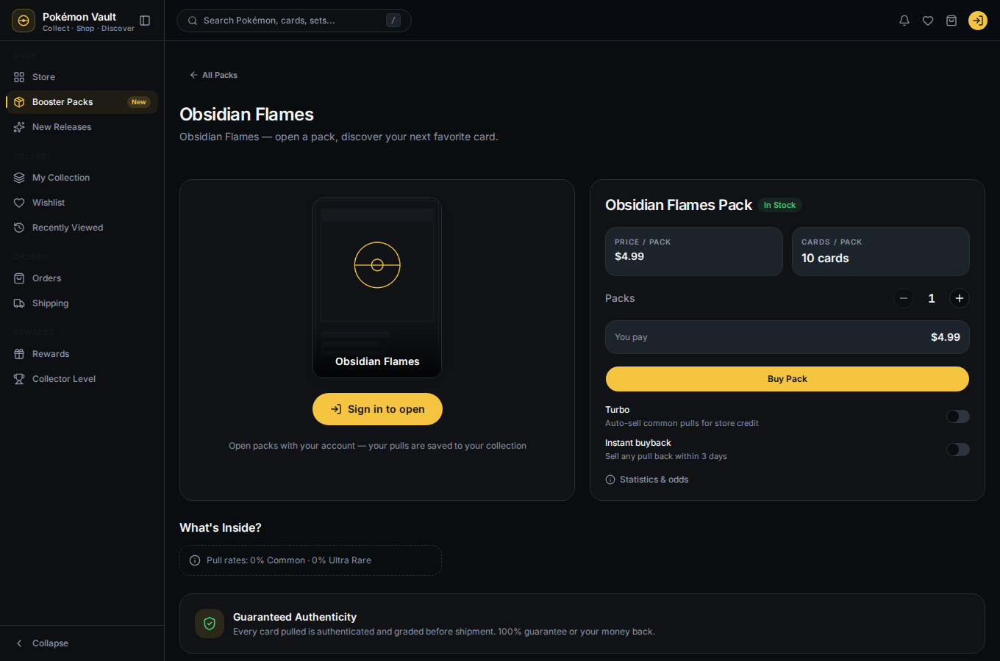
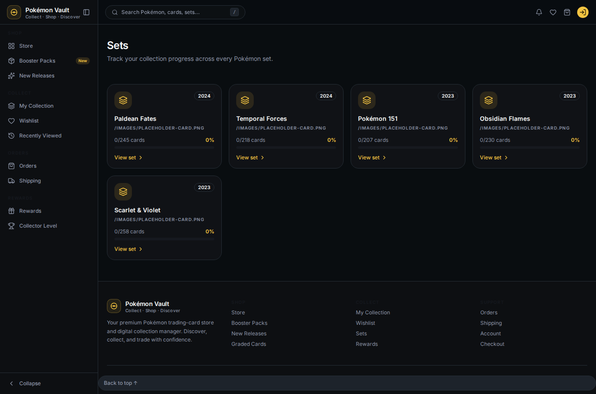
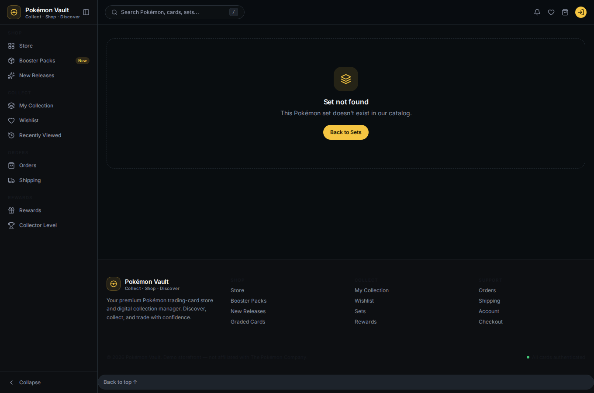
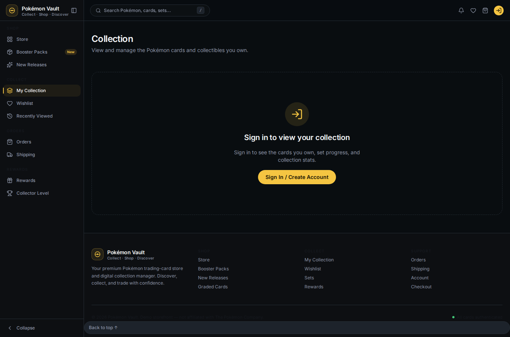
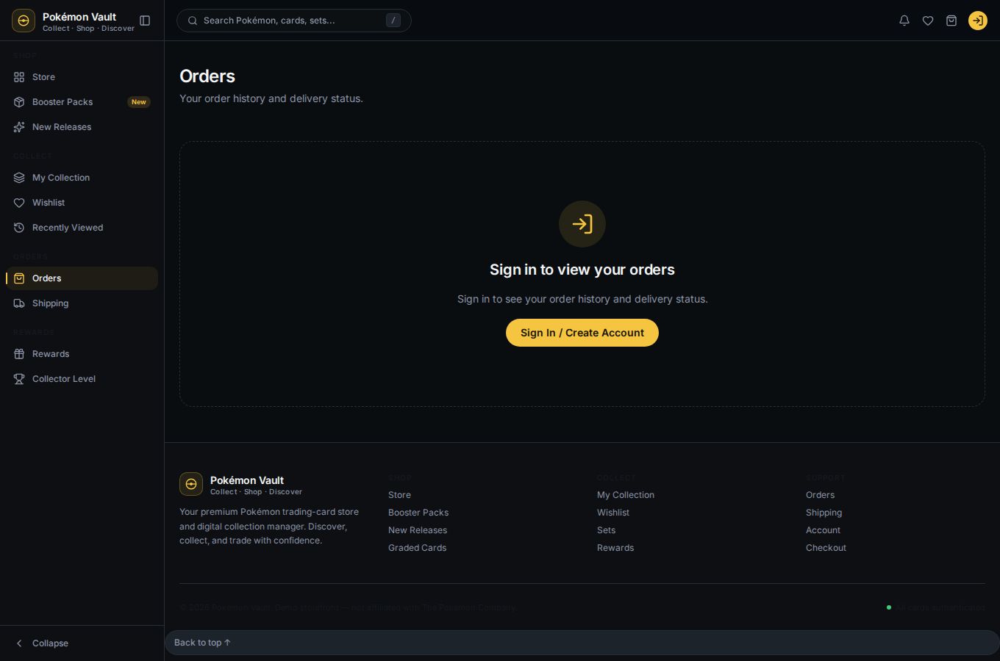
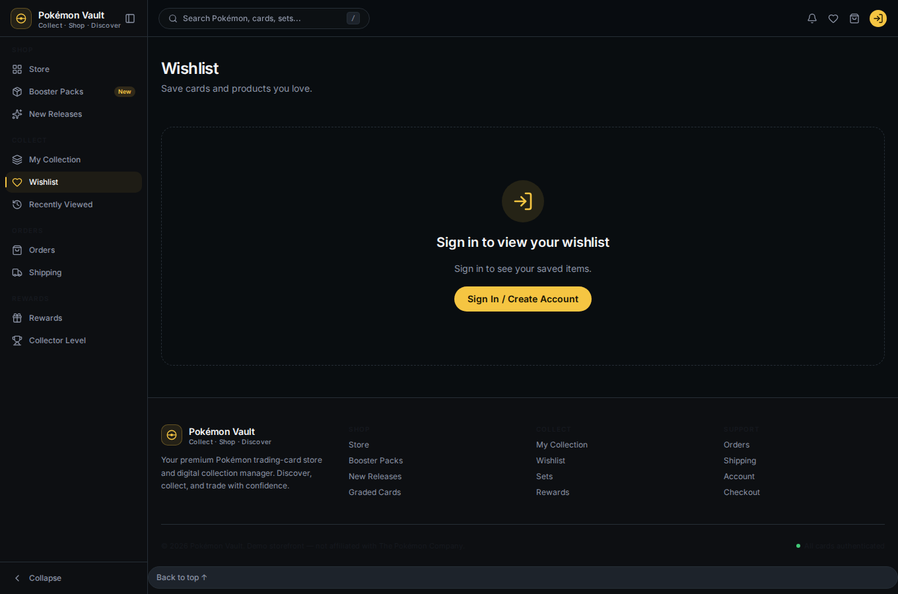
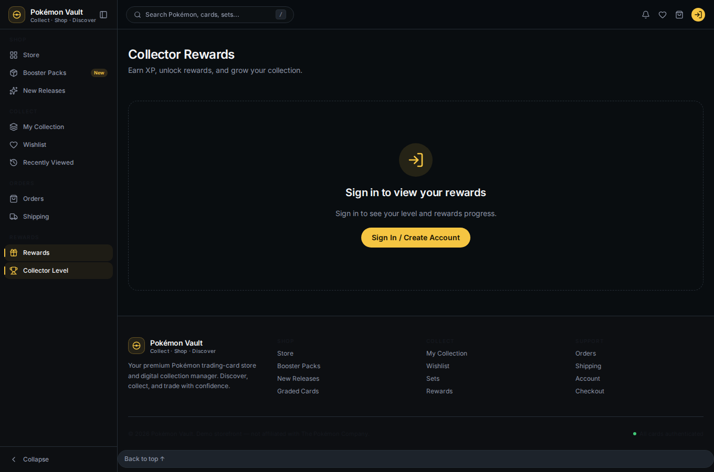
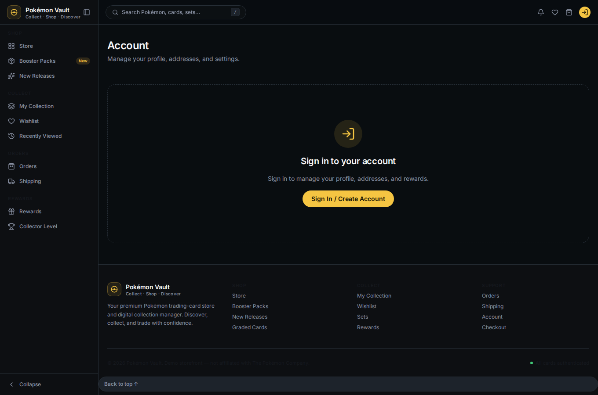
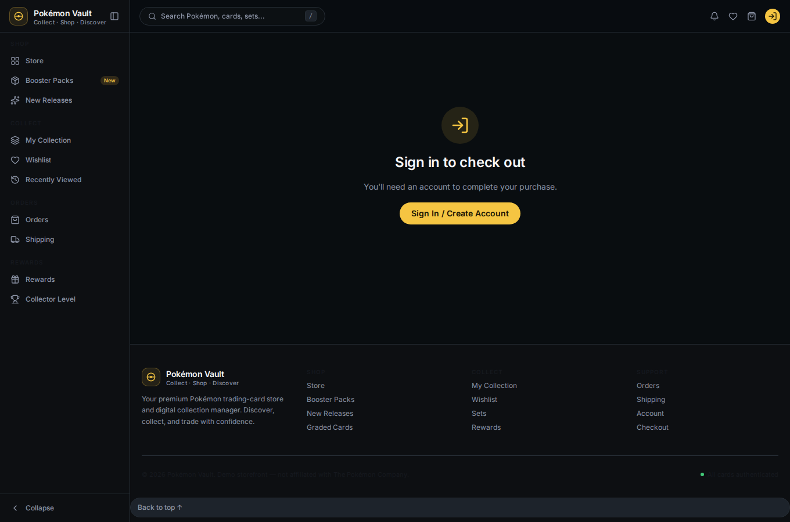

# 02 — Browse as a Guest

Anyone can browse the catalog without an account. This journey covers what a
**guest** sees: the home page, the store, booster packs, and sets.

## Home

`/` is the landing page — hero, trending products, featured graded cards,
latest sets, collector-rewards teaser, and a pack CTA. All of it comes from the
backend catalog.

## Store

The store (`/store`) lists every product with filters (category), search, and
sorting. Each card shows price, category and an **Add to Cart** button.

> Guests who click **Add to Cart** are prompted to sign in — the cart is tied
> to an account (see [04 — Shop & checkout](04-shop-and-checkout.md)).

## Booster Packs

The packs page (`/packs`) is a carousel of booster packs. Use the arrows or
the pack pills to switch packs, and **Open Pack** / **Buy Pack** are available
(open requires sign-in).

### Pack detail

Clicking through to a single pack (`/packs/<slug>`) shows the pack art,
price, contents and other packs in the catalog.

## Sets

`/sets` shows every Pokémon set with collection progress. Guests see the full
catalog and set completion percentages.

## Guest sign-in prompts

Account-based areas ask guests to sign in instead of showing blank pages:

| Page | Guest sees |
|---|---|
| Collection |  |
| Orders |  |
| Wishlist |  |
| Rewards |  |
| Account |  |
| Checkout |  |

## Next

→ [03 — Create an account & sign in](03-create-account-and-sign-in.md)
