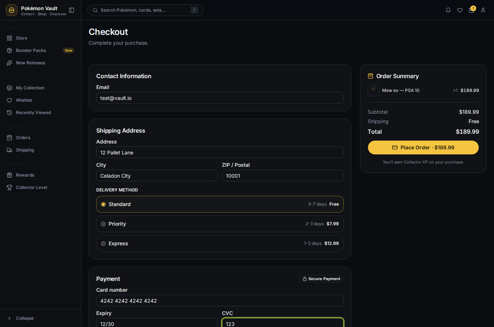

# 04 — Shop & Checkout

This journey walks the full purchase flow: add a product to your cart, review
the cart, fill in checkout details, and place a **real order** (persisted in
PostgreSQL; the dev stack uses the test payment provider — no real money).

## Add to cart

On the store (or any product card), click **Add to Cart**. The cart badge in
the top bar updates with the quantity.

Open the cart drawer to review items, change quantities, or remove an item.

## Checkout

Click **Checkout** in the drawer (or visit `/checkout`). Fill in:

- **Contact** — email
- **Shipping address** — address, city, ZIP
- **Delivery method** — Standard / Priority / Express
- **Payment** — demo card fields (any format works in dev)

## Place the order

Click **Place Order**. The backend validates the cart, creates a `PENDING`
order, finalizes it with the test payment provider, and persists it.

Your cart is cleared and the order appears under **Orders**.

## Next

→ [05 — Track orders](05-track-orders.md)
