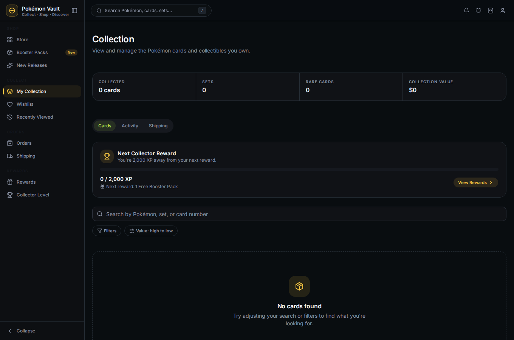
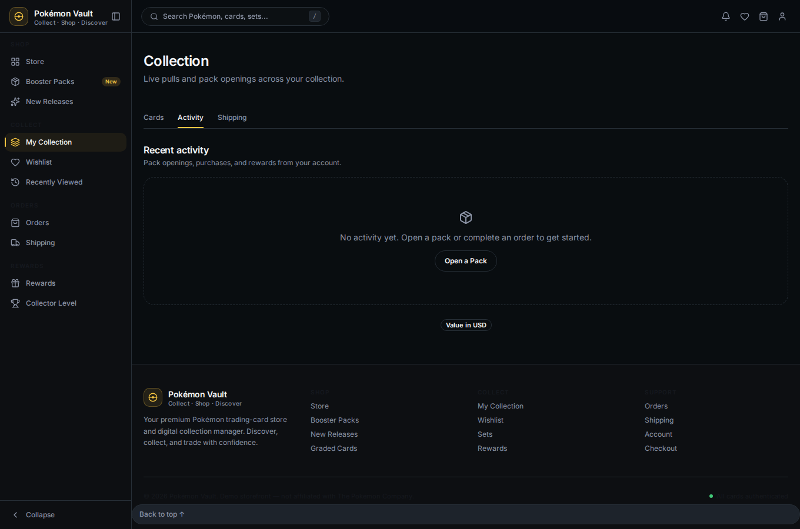
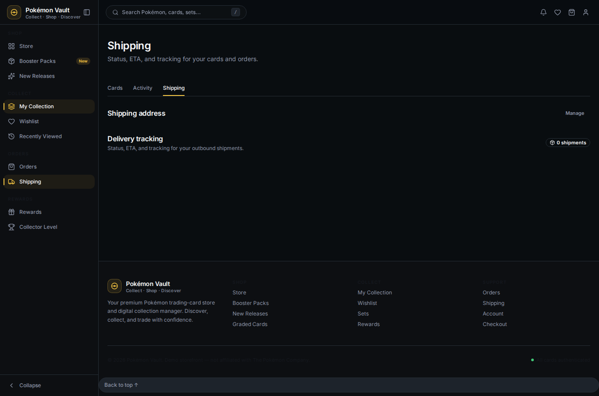

# 06 — Manage Your Collection

The collection is your catalog of owned cards, tracked server-side with
quantities, set progress, and a live activity feed.

## Collection grid

`/collection` shows stats (cards collected, sets, rares, value), a **Set
Progress** panel, filters/search/sort, and the card grid. Owned quantities come
from your backend collection items.

## Activity

The **Activity** tab (`/collection/activity`) is a live feed of your pack
openings, purchases, and rewards — grouped by day.

## Shipping

The **Shipping** tab (`/collection/shipping`) shows your saved addresses and
outbound shipments with tracking, ETA and progress.

## Next

→ [07 — Wishlist & rewards](07-wishlist-and-rewards.md)
