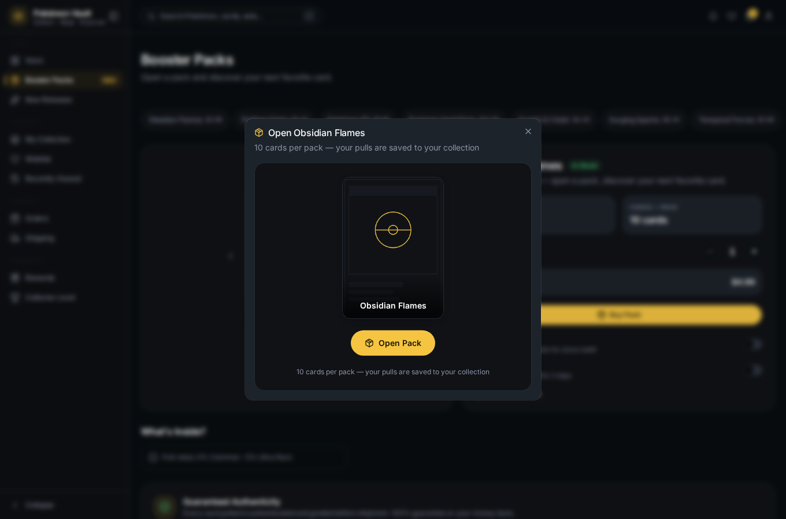

# 08 — Open Booster Packs

Pack openings are **server-determined**: you never pick the cards — the
backend generates the pulls from the pack's rarity odds, records an immutable
opening, and adds the cards to your collection.

## Open a pack

On the packs page, click **Open Pack** for the active pack.

The dialog confirms the pack contents, then animates the reveal.

## What happens

1. `POST /api/v1/packs/:slug/open` runs the opening server-side (with an
   idempotency key — retrying never double-opens).
2. The returned cards are animated one by one.
3. Each card is added to your **collection** (visible in
   [06 — Manage your collection](06-manage-collection.md)) and logged to your
   **activity** feed.

## Next

→ [09 — Account & sign out](09-account-and-sign-out.md)
