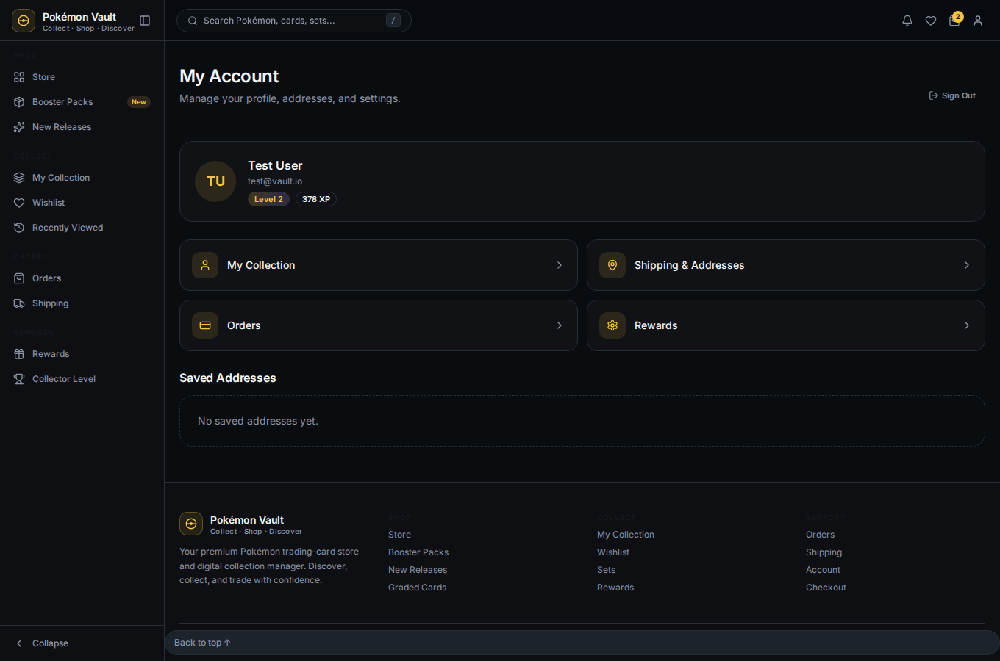
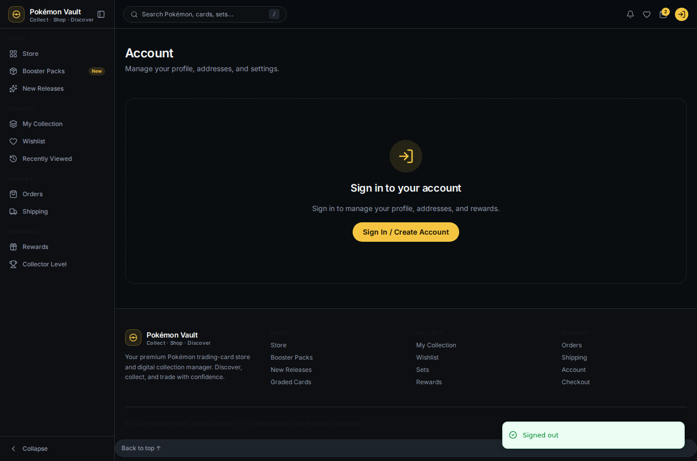

# 09 — Account & Sign Out

## Account

The **Account** page shows your profile (avatar initials, name, email, level
and XP) plus quick links and your **saved addresses** from the backend.

## Signing out

Click **Sign Out** in the account menu or on the account page. The session is
revoked server-side and the top bar returns to the guest state.

After signing out, personal pages show the sign-in prompt again (see
[02 — Browse as a guest](02-browse-as-guest.md)).

## Next

→ [10 — End-to-end journey](10-end-to-end-journey.md)
