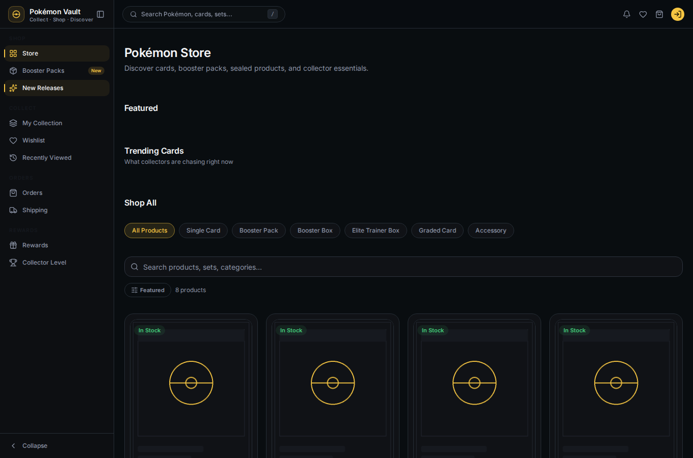
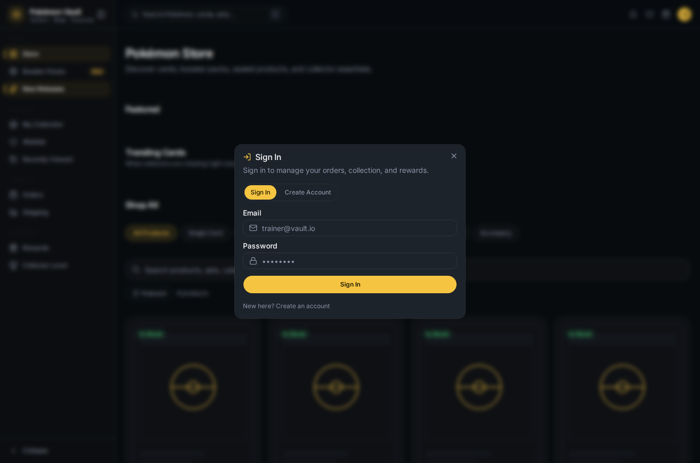
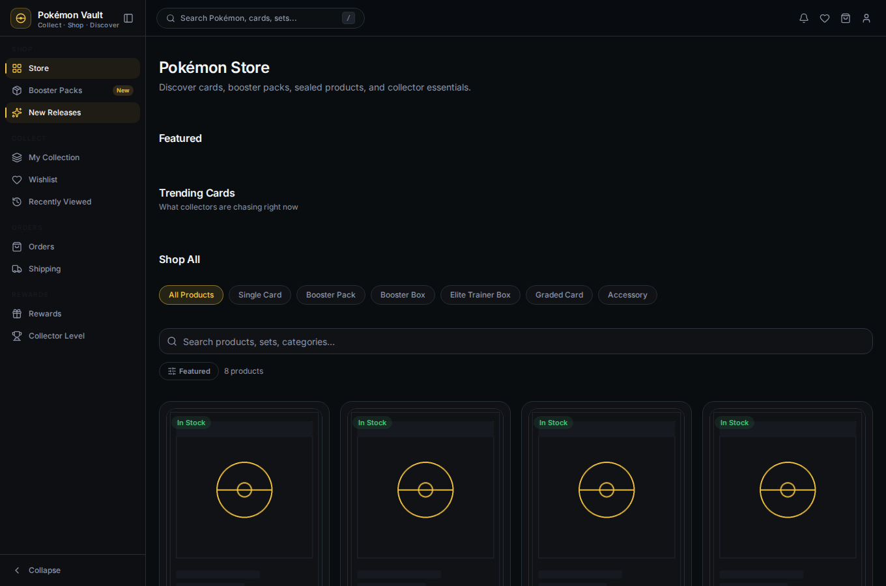
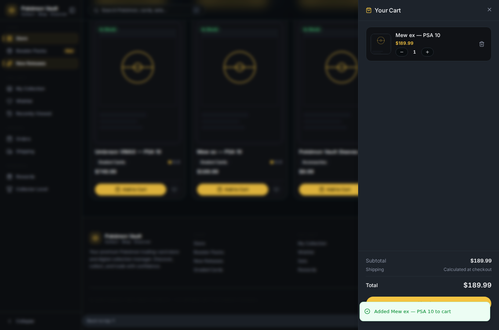
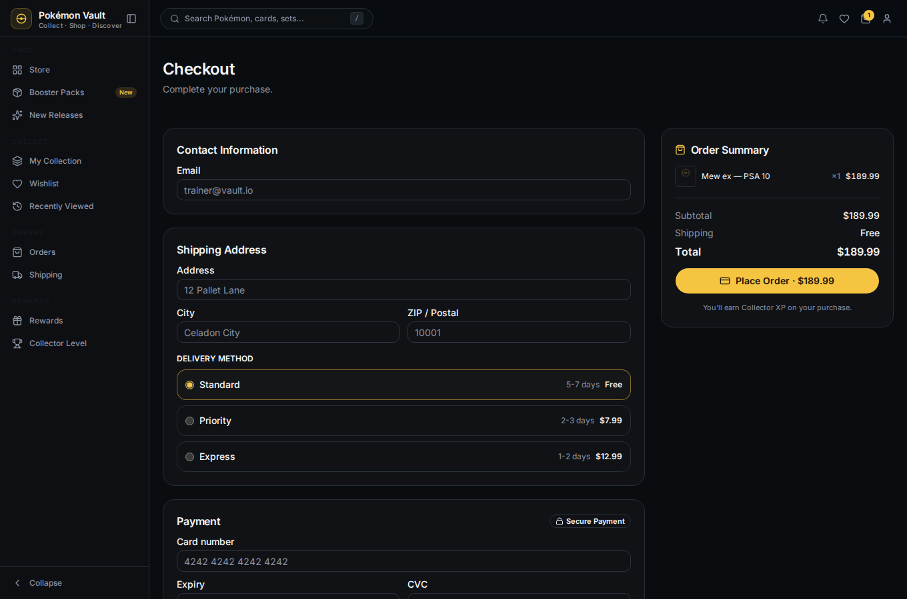
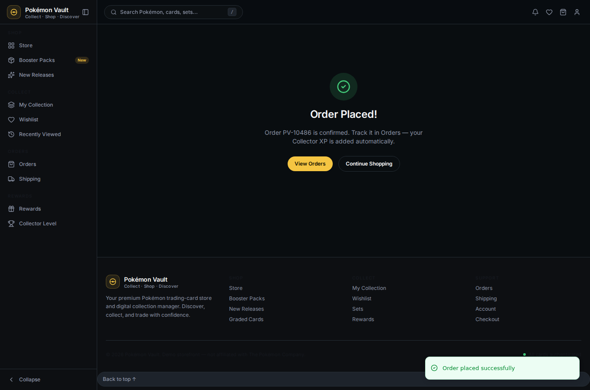
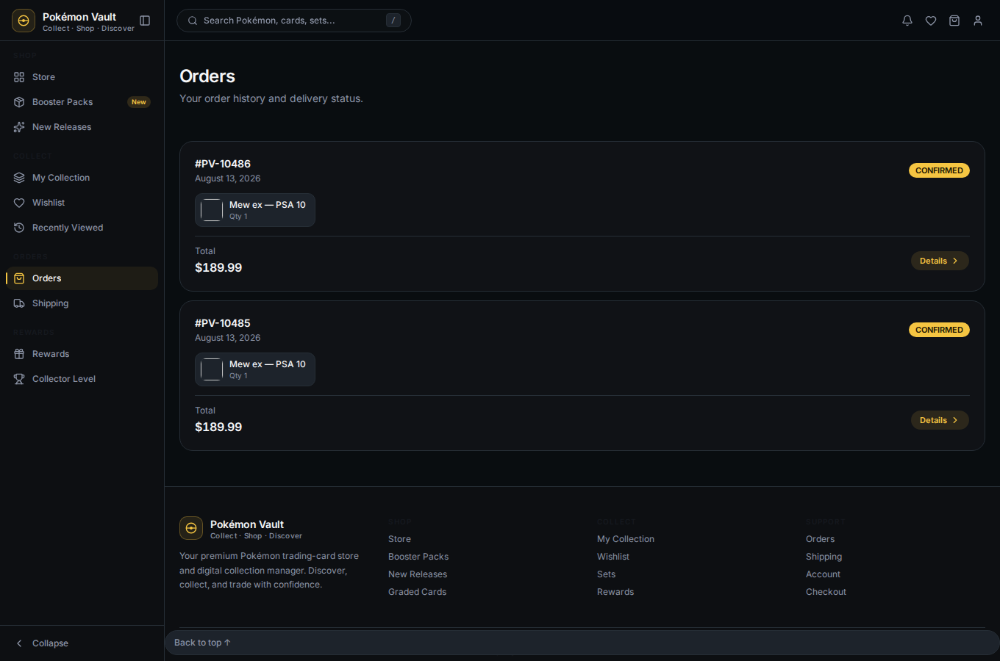
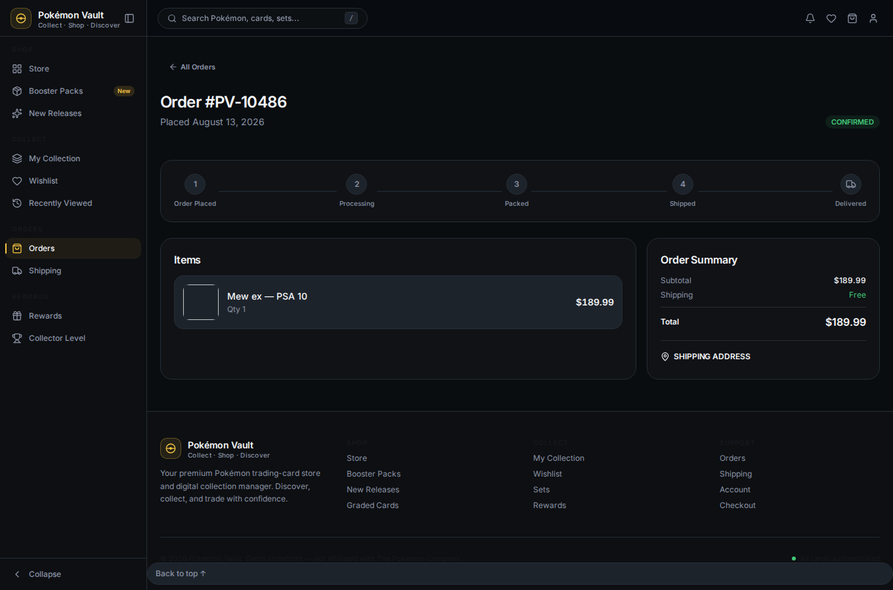
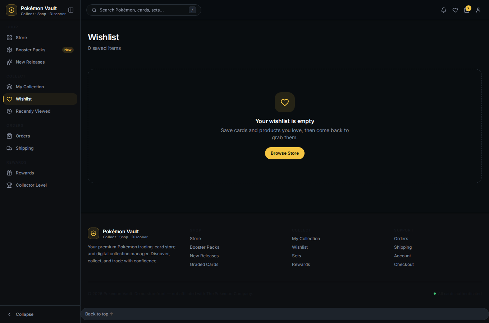
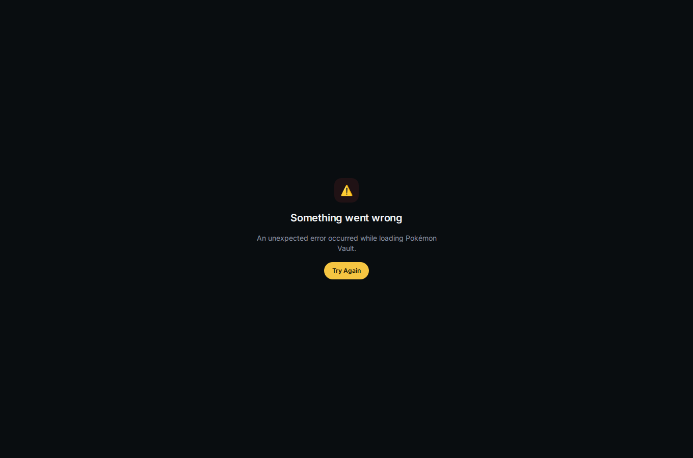

# 10 — End-to-End Journey

Putting it all together: one continuous story from guest to collector, using
the test user `test@vault.io` / `Str0ng!Passw0rd`.

## 1. Browse

Start as a guest on the **home** page, explore the **store**, **packs** and
**sets** — everything loads from the backend.

 · 

## 2. Create an account & sign in

Open the sign-in modal and **Create Account** (or sign in as the test user).
The live password checklist guides you; personal areas unlock.

 → 

## 3. Shop & checkout

Add a product to the cart, review it in the drawer, fill checkout, and place
the order.

 →  → 

## 4. Track the order

See the new order in **Orders** and open its detail with the status timeline.

 → 

## 5. Grow your collection

Open booster packs (server-side pulls) and watch the cards land in your
**collection** and **activity** feed.

 → 

## 6. Wishlist & rewards

Save products to your **wishlist**, and check your **Collector Level** and
**Reward Ladder**.

 → 

## 7. Manage your account & sign out

Review your profile and addresses in **Account**, then **Sign Out** to return
to the guest experience.

 → 

---

That's the complete journey. Re-run any step any time — all state lives in
the dev database, so you can reset with a fresh `./scripts/dev-env.sh down
--drop-db && ./scripts/dev-env.sh up`.
